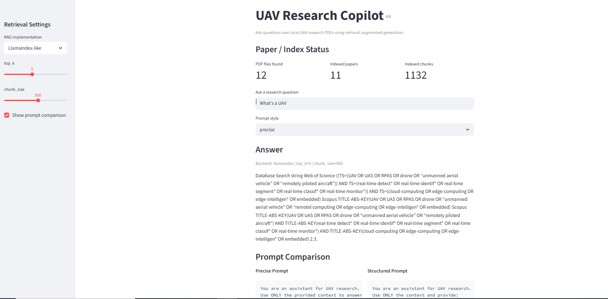

# UAV Research Copilot

A lightweight Python Retrieval-Augmented Generation (RAG) project for querying UAV research papers stored as local PDFs.

## Demo



## Features

- Loads PDF papers from `data/papers/`
- Chunks documents with overlap for better retrieval quality
- Builds lightweight local embeddings
- Stores vectors in a local NumPy vector database (`data/vector_store/`)
- Runs a RAG question-answering pipeline and returns source chunks
- Keeps prompt templates in a dedicated `prompts.py` module
- Evaluates at least two prompt styles (`precise` vs `structured`)
- Supports toggling between LangChain-like and LlamaIndex-like synthesis backends
- Includes adjustable retrieval controls (`top_k`, `chunk_size`) in Streamlit
- Ships with a 10-question UAV evaluation dataset
- Saves evaluation output to `results/eval_results.csv`
- Includes a Streamlit app for interactive QA and source inspection

## Project Structure

```text
uav-research-copilot/
├── app.py
├── ingest.py
├── rag_pipeline.py
├── evaluate.py
├── prompts.py
├── requirements.txt
├── README.md
├── data/
│   ├── papers/
│   └── vector_store/
├── results/
│   └── eval_results.csv
└── src/
    └── uav_research_copilot/
        ├── __init__.py
        ├── config.py
        ├── document_loader.py
        ├── chunking.py
        ├── vector_store.py
        ├── prompts.py
        ├── rag.py
        └── evaluation.py
```

## Installation

```bash
python -m venv .venv
source .venv/bin/activate
pip install -r requirements.txt
```

## Usage

### 1) Build the Vector Database

```bash
PYTHONPATH=src python ingest.py
```

This step loads all PDFs from `data/papers/`, creates chunks, computes embeddings, and saves:

- `data/vector_store/index.npy`
- `data/vector_store/metadata.json`

### 2) Ask a Question from CLI

```bash
PYTHONPATH=src python rag_pipeline.py "What acoustic features are used for UAV detection?" --style precise
```

Supported prompt styles:

- `precise`
- `structured`

Additional CLI options:

- `--implementation` (`langchain` or `llamaindex`)
- `--top-k`
- `--chunk-size`

### 3) Run Prompt-Style Evaluation

```bash
PYTHONPATH=src python evaluate.py
```

This writes evaluation results to:

- `results/eval_results.csv`

The evaluator reads 10 sample UAV questions from `data/evaluation/uav_eval_questions.json`.

### 4) Launch Streamlit App

```bash
PYTHONPATH=src streamlit run app.py
```

The app shows:

- file/index status
- backend toggle (`LangChain-like` vs `LlamaIndex-like`)
- retrieval settings panel (`top_k`, `chunk_size`)
- question input
- answer output
- side-by-side prompt comparison view
- retrieved source chunks

## Clean Code Notes

The codebase follows clean code principles by design:

- **Small focused functions** in separate modules
- **Centralized constants** in `config.py`
- **Meaningful names** for modules/functions/variables
- **Minimal duplication** across scripts via shared package code

## Troubleshooting

- If the app reports missing index, run `PYTHONPATH=src python ingest.py` first.
- If PDF extraction quality is poor, try cleaner PDF sources or OCR-converted versions.

## License

This project is provided for educational/research workflows.
